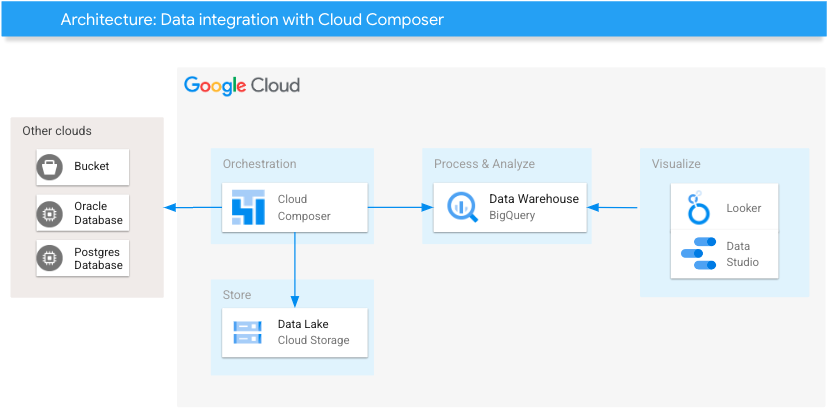

# Cloud Composer ETL  

## Description

This example demonstrates how to use Cloud Composer DAGS to:
- [Restore a Postgres backup](./dags/postgres_restore.py)
- [Extract data from Postgres and load to Cloud Storage (Data Lake)](./dags/postgres_to_datalake.py)
- [Load data from Cloud Storage (Data Lake) to BigQuery (Data Warehouse)](./dags/datalake_to_dw.py)
- [Transform data on BigQuery](./dags/bigquery_transform.py)

Resources created:
- VPC with firewall rules
- Cloud Composer v2
- Cloud SQL for Postgres
- Cloud Storage Buckets
- BigQuery datasets and tables

Check more operators available in [Airflow Google Operators doc](https://airflow.apache.org/docs/apache-airflow-providers-google/stable/operators/index.html).

## Architecture
Please find below a reference architecture.


## Deploy

1. Click on Open in Google Cloud Shell button below.
<a href="https://ssh.cloud.google.com/cloudshell/editor?cloudshell_git_repo=https://github.com/GoogleCloudPlatform/click-to-deploy-solutions&cloudshell_workspace=cloud-composer-etl" target="_new">
    
</a>

2. Run the `cloudbuild.sh` script and follow the instructions
```
sh cloudbuild.sh
```

Once it is finished, you can go to [Cloud Composer](https://console.cloud.google.com/composer/environments) to see the dags' results and explore the Cloud Composers's functionalities.


## Destroy

1. Click on Open in Google Cloud Shell button below.
<a href="https://ssh.cloud.google.com/cloudshell/editor?cloudshell_git_repo=https://github.com/GoogleCloudPlatform/click-to-deploy-solutions&cloudshell_workspace=cloud-composer-etl" target="_new">
    
</a>

2. Run the `cloudbuild.sh` script with `destroy` argument
```
sh cloudbuild.sh destroy
```
