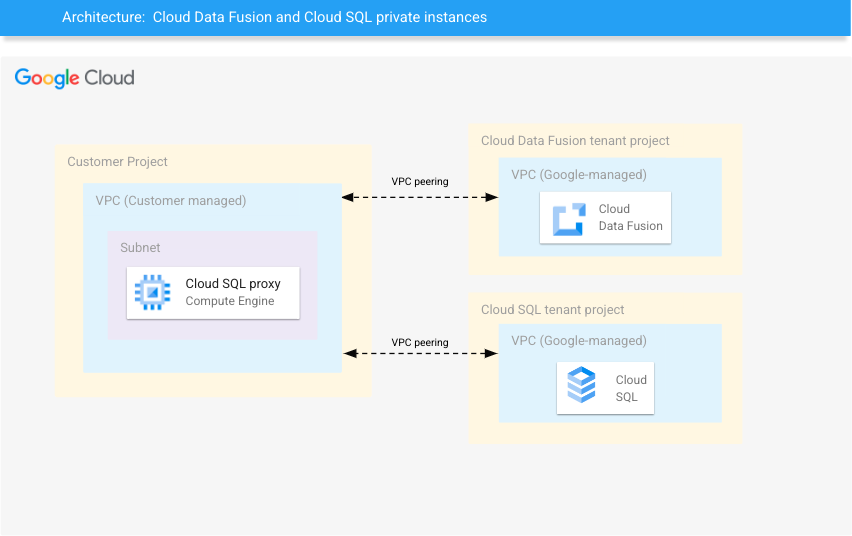

[](https://cloud.google.com/?utm_source=github&utm_medium=referral&utm_campaign=GCP&utm_content=packages_repository_banner)

# Google Cloud Private Data Fusion

This example deploys Cloud Data Fusion and Cloud SQL private instances, and establish communication between them.

Resources created
- VPC
- Compute Engine VM
- Cloud SQL for MySQL
- Cloud Data Fusion

:clock1: Estimated deployment time: 18 min 49 sec


## Architecture


## Deploy

1. Click on Open in Google Cloud Shell button below.
<a href="https://ssh.cloud.google.com/cloudshell/editor?cloudshell_git_repo=https://github.com/GoogleCloudPlatform/click-to-deploy-solutions&cloudshell_workspace=private-cloud-data-fusion" target="_new">
    
</a>

2. Run the `cloudbuild.sh` script and follow the instructions
```
sh cloudbuild.sh
```

After you created the resources, you can use the Cloud SQL Proxy VM's internal IP to connect from Cloud Data Fusion to Cloud SQL. Before you can connect to the MySQL instance from the Cloud Data Fusion instance, install the MySQL JDBC driver from the Cloud Data Fusion Hub.

For more information on how to setup this connection, please refer to [this link](https://cloud.google.com/data-fusion/docs/how-to/connect-to-cloud-sql-source).

## Destroy
Execute the command below on Cloud Shell to destroy the resources.
```
sh cloudbuild.sh destroy
```

## Useful links
- [Cloud Data Fusion How-to guides](https://cloud.google.com/data-fusion/docs/how-to)
- [Cloud SQL](https://cloud.google.com/sql)

## Tips
1. Use the private ip of the CloudSQL proxy in the Connection Name field in Fusion, not the CloudSLQ private ip
2. username for the database is: datafusion
3. get the password for the database in the Secret Manager
4. The MySQL database preconfigured is called employees

## For organizations with Shielded VMs enforcing policies
1. Configure the Dataproc nodes to use Shielded VMs
To do this, after you deployed the pipeline in Data Fusion, click in "Configure" and go to "Compute config"
Click in "Customize" in the prefered Profile Name
Go to the Shielded VMs section and click to change to True all the options
Enable secure boot, Enable vTPM and Enable integrity Monitoring
Now you can run the pipeline
