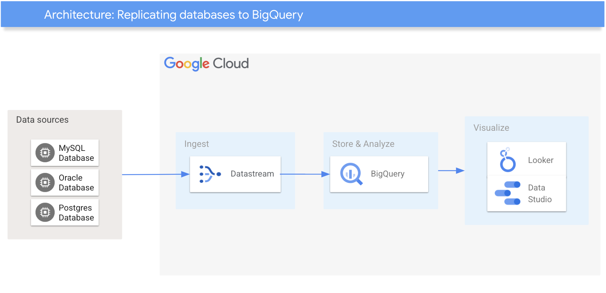

[](https://cloud.google.com/?utm_source=github&utm_medium=referral&utm_campaign=GCP&utm_content=packages_repository_banner)

# Replicate your Databases into a Data Warehouse solution for data analysis in Google Cloud

## Introduction

This architecture uses a click-to-deploy method to allow customers with traditional databases to stream data changes directly to BigQuery and visualize the data with [Looker Studio](https://support.google.com/datastudio/answer/6283323?hl=en) or [Looker](https://www.looker.com/).

In today's competitive business environment, organizations need to make informed decisions based on data insights to gain a competitive edge. Traditional SQL databases are reliable data storage systems, but they lack the advanced analytics and machine learning capabilities needed to extract valuable insights from large datasets efficiently. This limitation has led organizations to seek solutions that bridge the gap between their existing databases and enterprise-grade data warehouses like BigQuery.

BigQuery is a fully-managed data warehouse that offers a robust infrastructure and advanced analytical capabilities. It allows organizations to quickly extract actionable insights from their data. By replicating their SQL databases to BigQuery, organizations can seamlessly leverage its strengths to unlock the true potential of their data.

The replication process uses tools like Google Data Stream to ingest data from various sources, including relational databases and transactional systems, into BigQuery in near real-time. This continuous flow of data ensures that the data warehouse remains up-to-date with the latest changes from the source systems.

In summary, replicating SQL databases to BigQuery provides organizations with a seamless pathway to leverage the strong analytical and machine learning capabilities of an enterprise-grade data warehouse. It allows them to transition from traditional databases to a high-performance environment, unlocking the potential for faster data processing, advanced analytics, and actionable insights that drive business success.

Resources created
- VPC
- Data Stream
- Cloud SQL for MySQL

:clock1: Estimated deployment time: 10 min 16 sec



## Deploy

1. Click on Open in Google Cloud Shell button below.
<a href="https://ssh.cloud.google.com/cloudshell/editor?shellonly=true&cloudshell_git_repo=https://github.com/GoogleCloudPlatform/click-to-deploy-solutions&cloudshell_workspace=replicating-databases-bigquery" target="_new">
    
</a>

2. Run the `deploy.sh` script
```
sh cloudbuild.sh
```
## Destroy
Execute the command below on Cloud Shell to destroy the resources.
```
sh cloudbuild.sh destroy
```

This is not an official Google product.