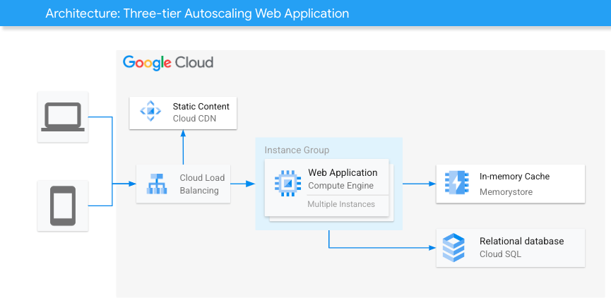

[](https://cloud.google.com/?utm_source=github&utm_medium=referral&utm_campaign=GCP&utm_content=packages_repository_banner)

# Three-tier Web Application on GCE

This example deploys the infrastructure to run a three-tier autoscaling web application on GCE using Managed Instance Groups.
The application can connect to Cloud SQL and Redis using private IPs, it uses load balacing for incoming traffic and Cloud NAT for egress traffic. Also, it is protected by Cloud Armor with pre-defined WAF rules.


## Architecture


## Deploy

1. Click on Open in Google Cloud Shell button below.
<a href="https://ssh.cloud.google.com/cloudshell/editor?cloudshell_git_repo=https://github.com/GoogleCloudPlatform/click-to-deploy-solutions&cloudshell_workspace=three-tier-app-gce" target="_new">
    
</a>

2. Run the `cloudbuild.sh` script and follow the instructions
```
sh cloudbuild.sh
```

## Destroy
1. Click on Open in Google Cloud Shell button below.
<a href="https://ssh.cloud.google.com/cloudshell/editor?cloudshell_git_repo=https://github.com/GoogleCloudPlatform/click-to-deploy-solutions&cloudshell_workspace=three-tier-app-gce" target="_new">
    
</a>

2. Run the `cloudbuild.sh` script with the `destroy` argument
```
sh cloudbuild.sh destroy
```
