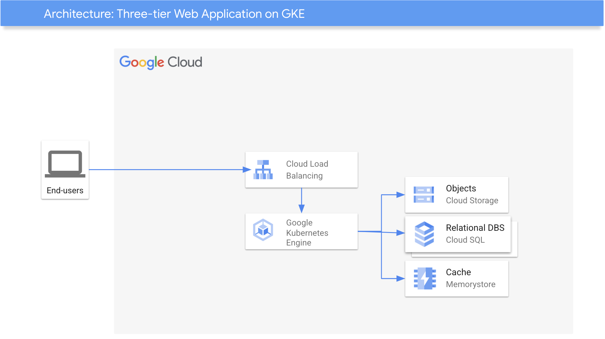

[](https://cloud.google.com/?utm_source=github&utm_medium=referral&utm_campaign=GCP&utm_content=packages_repository_banner)

# Three-tier web application with Google Kubernetes Engine (GKE)

## Introduction

This architecture uses click-to-deploy so you can spin up infrastructure in minutes using terraform!

In the world of modern web development, it is essential to create scalable and reliable applications. To achieve this, a three-tier architecture has become a popular approach. This architectural pattern divides an application into three distinct layers: presentation, business logic, and data storage. Each layer has its own set of responsibilities, allowing for flexibility, maintainability, and efficient resource utilization. 

This solution focuses on the combination of GKE clusters, which allows for automatic scaling as needed, Cloud SQL as a relational database, Cloud Storage for unstructured data, and Memorystore for caching, which reduces database access on frequent queries. This solution provides a powerful and robust infrastructure for hosting a three-tier web application.

Resources created
- VPC
- GKE
- Cloud SQL for MySQL
- Cloud Storage

:clock1: Estimated deployment time: 12 min

## Architecture


## Deploy

1. Click on Open in Google Cloud Shell button below.
<a href="https://ssh.cloud.google.com/cloudshell/editor?shellonly=true&cloudshell_git_repo=https://github.com/GoogleCloudPlatform/click-to-deploy-solutions&cloudshell_workspace=three-tier-gke" target="_new">
    
</a>

2. Run the `deploy.sh` script
```
sh cloudbuild.sh
```

## Destroy
Execute the command below on Cloud Shell to destroy the resources.
```
sh cloudbuild.sh destroy
```

This is not an official Google product.
